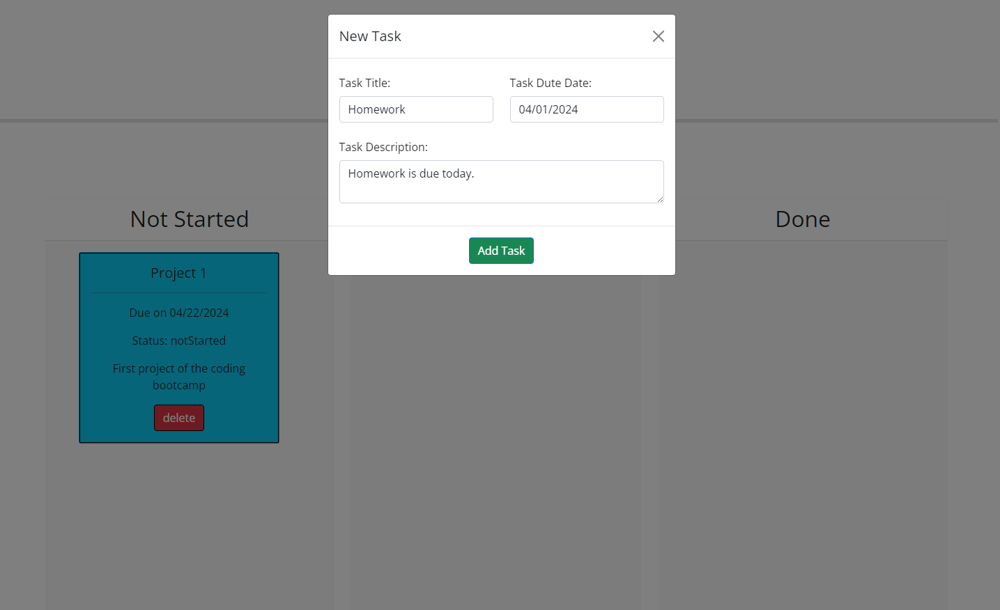
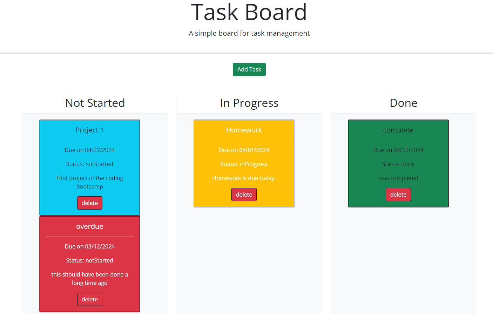

# Task Board

## Descrption

This is a simple website for creating and storing tasks. It also gives the ability to move the tasks into different columns on the page depending on their current status

## Table of Contents

- [ScreenShots](#screenshots)
- [Links](#links)
- [API](#api)
- [References](#references)
- [Resources](#resources)
- [Contributing](#contributing)
- [License](#license)

## Screenshots
### Input a title, date and a description:

#### New task will automatically go into the 'Not Started' column
#### Tasks can be moved by dragging, to another column
#### Local storage will be used to keep track of user's tasks
#### The delete button will remove the task card from the screen and from the local storage

### Example of what the board would look like with all 4 colors:

### Task represent:
#### -Red = overdue
#### -Yellow = due today
#### -Blue = due at a later date
#### -Green = completed
## Links

[Task Board](https://djinjones.github.io/Task-Board/)

## API

N/A

## References

- [Mdn](https://developer.mozilla.org/en-US/)
- [W3 schools](https://www.w3schools.com)

## Resources

- [Github banner generator](https://leviarista.github.io/github-profile-header-generator/)
- [Github markdown-badges](https://ileriayo.github.io/markdown-badges/)

## Contributing

N/A

## License

[MIT © Richard McRichface.](../LICENSE)
